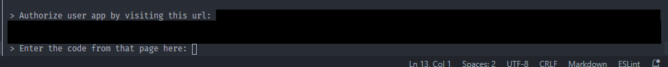
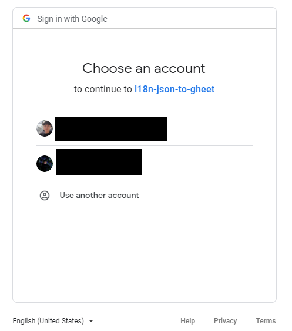
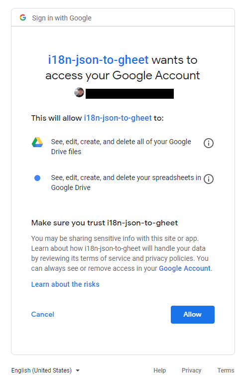
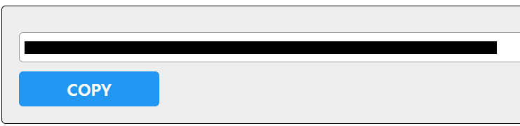

# Create oAuth token with credentials 
This exmplate show how to get oAuth token with json-to-google-sheets. 

## Steps
- Run script
```
$ node index.js
```
- Visit the url  
  

- Select your google account.  
  

- Check the scopes.  
  

- Copy the generated code.  
  

- Paste the codes for generating token.

